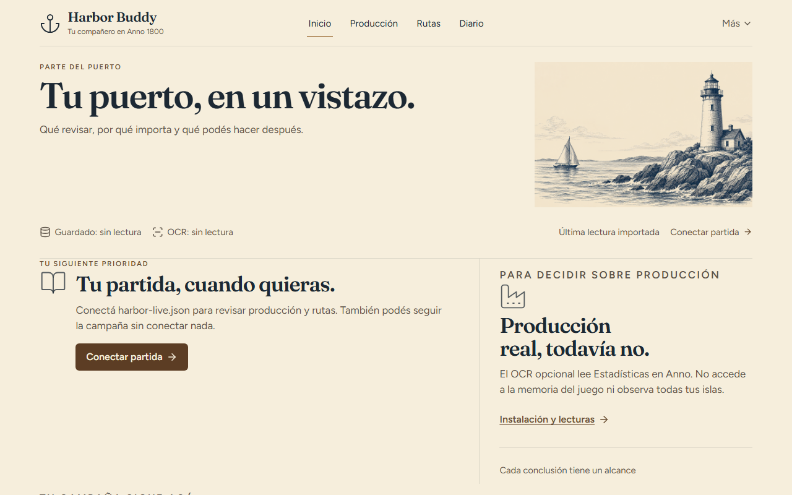
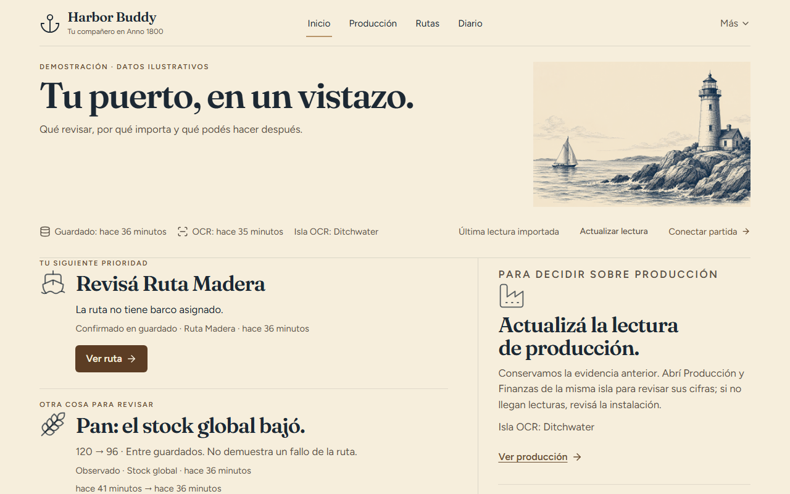
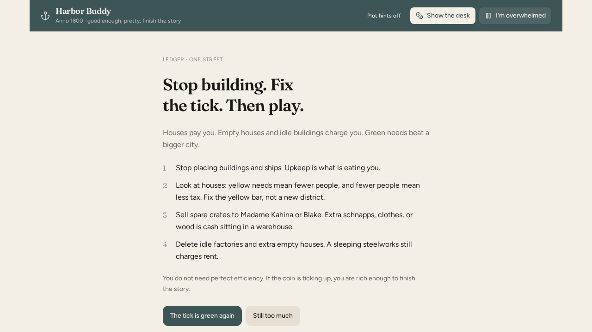

# Anno 1800 Buddy

A calm, Spanish-first companion for a personal Anno 1800 campaign. Keep Anno fullscreen; keep Harbor in the background and alt-tab when you want a glance. Not an overlay, not always-on-top, and not click-through on the game.

**Inicio** (`/`) is the operational summary: at most three issues, conclusion first, evidence and age on one line. **Diario** (`/diario`) is the campaign desk. Production detail lives in `/taller`. Route evidence lives in `/rutas`. Connect and install stay under Más.

Not a min-max spreadsheet. Spoilers stay off by default. Tagline: *bastante bien, lindo, terminá la historia.*

`/taller` is an opt-in workbench (not Inicio): one **Alcanza / No alcanza** stamp from **static versioned wiki ratios** (`wiki-v1-2026-09`, [Production chains](https://anno1800.fandom.com/wiki/Production_chains), CC-BY-SA) times the live snapshot fields that already exist (balance, saturation/workforce, session buildings). Method inspired by [NiHoel/Anno1800Calculator](https://github.com/NiHoel/Anno1800Calculator) (**MIT except `params.js`**). This app does **not** copy `params.js` (Ubisoft game assets). Not a factory simulator, goods grid, or t/min hero.

[github.com/crisesarmiento/anno-1800-expert-buddy](https://github.com/crisesarmiento/anno-1800-expert-buddy)

## A look at the buddy

| Inicio (empty)                                                                                                                                      | Inicio (demo snapshot)                                                                                          |
| --------------------------------------------------------------------------------------------------------------------------------------------------- | --------------------------------------------------------------------------------------------------------------- |
|                             |              |
| **Campaign diary**                                                                                                                                  | **Economy pulse**                                                                                               |
|                                                            |               |

The demo screenshot uses `docs/fixtures/editorial-demo.json`. It is labelled in the UI as illustrative data, not a real save.

## Design skill pack

The repository includes an [Agent Skills design pack](.grok/skills/README.md) for future work on Harbor Buddy. Its ten focused skills cover the visual system, original building icons, 10×10 grids, mission chrome, economy pulse, diplomacy, presence charts, Rioplatense copy, source handling, and visual QA. The pack guides design work only; it does not replace the existing React and TanStack Start product architecture.

## Why it exists

The campaign is easier when someone on the sofa tells you one next step instead of a wiki dump. Harbor is that voice: Spanish-first (UI also in English, Italian, and German), one glance on Inicio, one mission at a time in Diario. It works on a second monitor, or on the same monitor via alt-tab. Not an overlay and not click-through on the game.

Inicio only speaks when the evidence is honest:

- Route failures are confirmed from the save (no ship, fewer than two stops, or no goods).
- Production shortfall or excess is inferred, and only when demand, productivity, factory count, a known catalog rate, the same island, and a fresh OCR sample are all present.
- Stock drops are global observations between saves. They do not prove a route caused the change.
- Save time, OCR time, and connection state stay separate. JSON file time is never an observation.

## Local-first data and privacy

Campaign progress, desk checks, stamps, pulse, and last session live in **this browser only** (`localStorage` under `hb-session:` / `harbor-buddy-es`). No accounts. Auth and a remote database are **off** (`VITE_AUTH_ENABLED=false`). No `.env` and no `DATABASE_URL` for the companion itself.

The desk restores on cold start without waiting on a network. Chat without a live radio shows `radio apagada — usá la lista` and keeps using the local list. Clearing site data or switching origin wipes progress. Nothing is synced across devices.

Optional Windows live diary (`harbor-live.json`) is a local file you drop or paste. The browser never reads `Documentos\Anno 1800` on its own and never parses `.a7s` saves.

## Status

### Reading a real game

1. Run the save watcher and use **Connect → Watch file** to select `harbor-live.json`.
   Dropping/pasting a file imports one snapshot; it does not establish a live connection.
2. Optional OCR: download the official [Anno1800UXEnhancer release](https://github.com/NiHoel/Anno1800UXEnhancer/releases/tag/v11.0),
   extract the **whole archive**, and run **Server.exe**, not the separate reroll bot `UXEnhancer.exe`.
   The launcher detects `Server.exe` beside it or inside an adjacent `UXEnhancer` folder;
   a version-named folder elsewhere in Downloads is not automatically discovered.
3. Keep Anno's Statistics visible in borderless mode. Select one island, open Production,
   then Finance. The watcher defaults to Spanish OCR; its `NativeLanguage` must match the game.
4. In Production, check the island and observation time. Construction/pause advice requires
   recent Production **and** Finance evidence for that island and a known catalog rate.

The selected-file reader survives navigation between Inicio, Production, Routes, and Diary.
Pause/remove cancels pending reads; transient/partial reads retain the last valid snapshot and retry.
After a full browser reload, explicitly refresh/re-authorize the saved file handle. Background tabs
may be throttled by the browser; returning to the tab triggers another read.

Server reachability is not fresh game data. A responding server may find no window or recognize
no island; those probes do not refresh the previous observation's timestamp. OCR only reads the
visible statistics, not the entire economy in the background. See [OCR details](docs/native-telemetry.md).

Playable companion: Inicio operational glance, campaign diary on `/diario`, session desk (next step / do-don't / checks), city stamps, island pulse, calm modes (*Estoy saturado*, *Monedas en rojo*), Spanish buddy chat, HUD screenshot paste for one next step, and `/tablero` as a secondary presence view.

Optional extras on Windows: install page (`/instalar`), connect page (`/conectar`), and a save watcher that writes `harbor-live.json`. The in-game pack does **not** run Lua (that crashes Anno); the watcher reads the latest save instead. Hard ceiling: `docs/telemetry-ceiling.md` — read-only on `.a7s`, no Lua/DLL/Python inject; the telemetry zip is a stub and is not required for the watcher.

`package.json` still names the Grok export (`app-builder-workspace`). That is not the product name.

## Prerequisites

- **Node.js 22** (the sandbox/export contract; no `engines` field in `package.json`)
- **npm** (this repo ships `package-lock.json`)

## Install

```bash
git clone https://github.com/crisesarmiento/anno-1800-expert-buddy.git
cd anno-1800-expert-buddy
npm install
```

## Develop

```bash
npm run dev
```

Vite listens on **`0.0.0.0:8080`** (`strictPort`). Open http://127.0.0.1:8080/

`npm run dev` packs the telemetry zip (`scripts/pack-mod.mjs`) then starts Vite through `scripts/with-app-env.mjs`.

Useful extras (not required to run the app):

```bash
npm test
npm run typecheck
npm run lint
```

## Production build

```bash
npm run build
npm run preview
```

`npm run build` packs the mod zip, runs `vite build`, then `npm run db:migrate`. With no `DATABASE_URL`, migrate **skips** (local/preview). Nitro's production preview is **`127.0.0.1:8081`**.

Do not use `vite` / `npx vite` directly — env flags (`VITE_AUTH_ENABLED`) only load through the npm scripts.

## Limitations

- Unofficial fan companion. Anno 1800 is Ubisoft; this is not affiliated.
- Tab/PWA only — never an overlay, never always-on-top, never click-through on Anno. First monitor / Ctrl+G stays the game. One monitor: alt-tab. See `docs/second-screen.md`.
- Mission titles stay in Spanish to match the in-game journal.
- Screenshot HUD advice is a local server function. Offline chat does not invent a vision call.
- `scripts/preview.mjs stop|restart` is a Linux sandbox helper for port 8081, not a macOS/Windows workflow.
- `AGENTS.md` and `.grok/` are the Grok App Builder contract, not player docs.

## License

Source is Cristian Sarmiento's. Anno 1800 is Ubisoft. Unofficial fan companion, not affiliated with Ubisoft.
