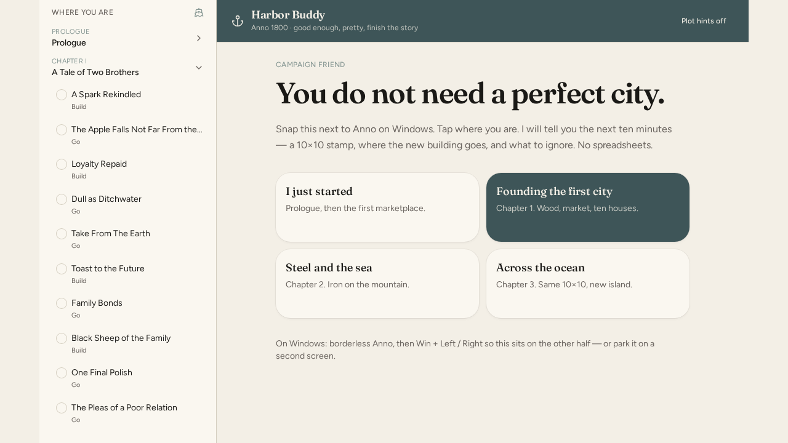
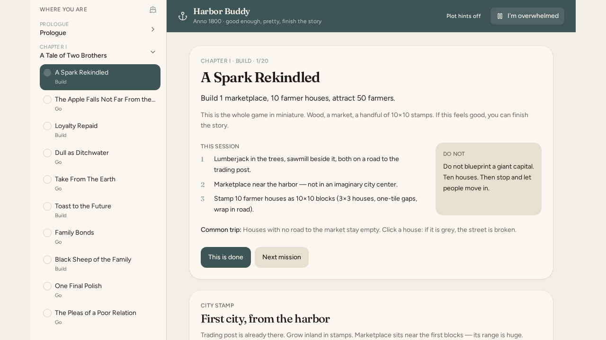

# Anno 1800 Buddy

A Spanish campaign companion for **Anno 1800**. Sit it next to the game, tap where you are in the story, and it gives you the next ten minutes: a 10×10 city stamp, where the new building actually goes, how not to go broke, and who not to fight.

Not a min-max spreadsheet. Default is **spoilers off**. Progress stays in the browser.

Built overnight with Grok App Builder, then exported here. Product name in the UI: **Anno 1800 Buddy**. Tagline: *bastante bien, lindo, terminá la historia.*

[github.com/crisesarmiento/anno-1800-expert-buddy](https://github.com/crisesarmiento/anno-1800-expert-buddy)

## What it does

- Campaign rail from prologue through later chapters, one mission at a time
- Session desk: next step, do/don't, common trap, check off what you already did
- City stamps (notebook grids, not game art) and building placement notes
- Island pulse: coins / houses / what you are looking at, so the advice changes with the screen
- Calm modes: *Estoy saturado* (one thing) and *Monedas en rojo* (stop building, fix the ticker)
- Buddy chat, in Spanish, as if someone is on the sofa next to you

## Screens





## Run locally

Node 22.

```bash
npm install
npm run dev
```

Dev server is `0.0.0.0:8080` (Grok preview contract). Production build:

```bash
npm run build
npm run preview
```

Auth and database are **off**. No accounts. No `.env` required for the companion itself.

## Repo shape (honest)

This is a raw Grok App Builder export, not a cleaned template.

| Path | What it is |
| --- | --- |
| `src/components/harbor-app.tsx` | The product |
| `src/lib/data` | Campaign missions, layouts, people |
| `src/lib/buddy` | Chat answers |
| `AGENTS.md` | Grok sandbox contract, not app docs |
| `.grok/` | Builder metadata |
| `screenshots/` | QA captures from the build |

`package.json` still says `app-builder-workspace`. That is the export name, not the product name.

## License

Source is Cristian Sarmiento's. Anno 1800 is Ubisoft. This is an unofficial fan companion, not affiliated with Ubisoft.
